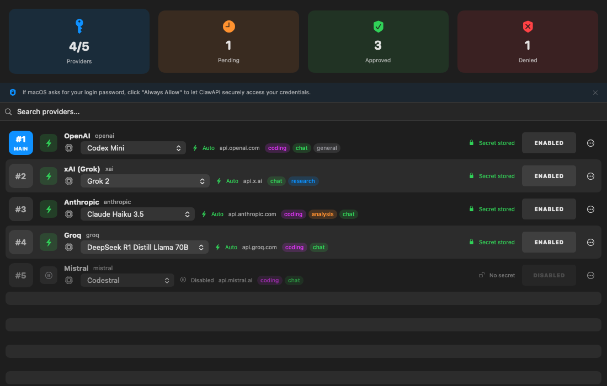
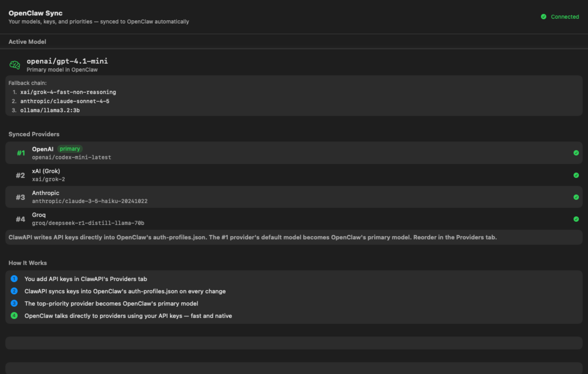
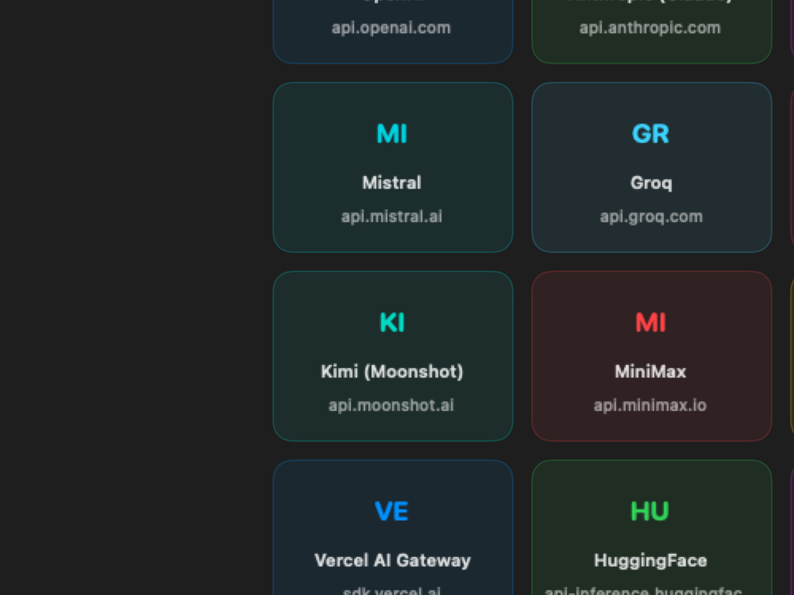
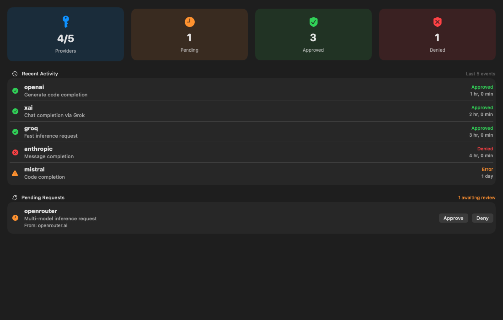
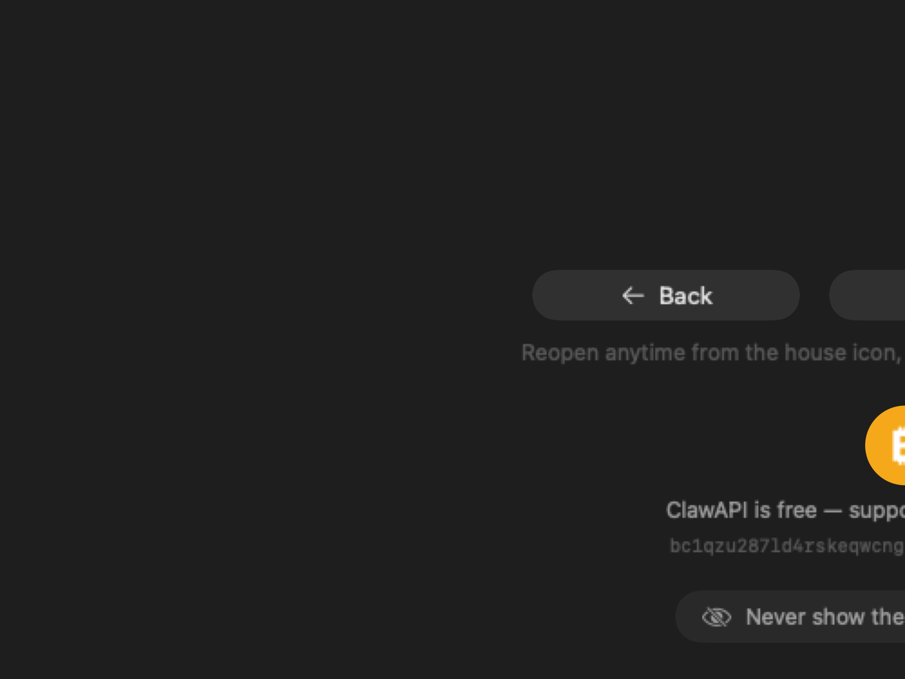
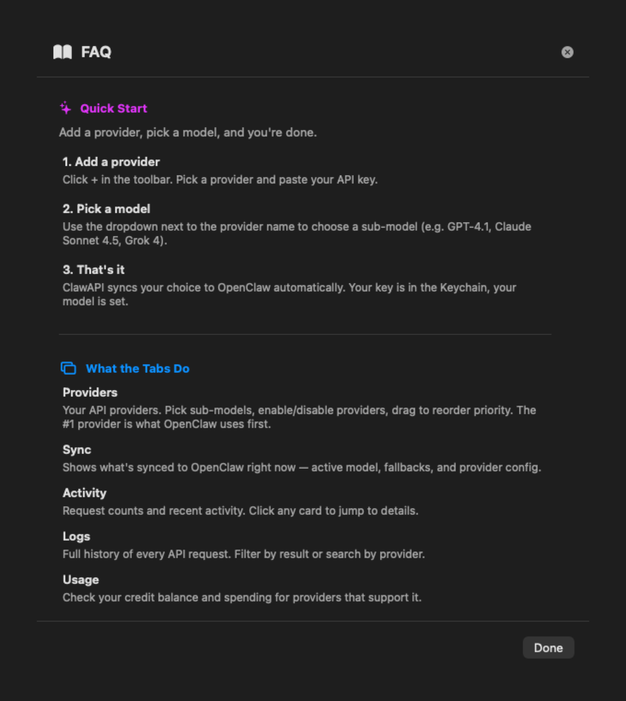

<p align="center">
  
</p>

<h1 align="center">ClawAPI</h1>
<p align="center"><strong>Model Switcher & Key Vault for OpenClaw</strong></p>
<p align="center">
A native macOS app that lets you switch AI models and securely manage API keys for <a href="https://openclaw.app">OpenClaw</a>.<br>
Supports OpenAI, Anthropic, Google, xAI, Groq, Mistral, Ollama, and 25+ more providers.<br>
All keys stored in the macOS Keychain — never on disk.
</p>

---

## Demo

[](https://youtu.be/py5JlKiTWLo?si=oa-VG6WXVYfqIGyR)

▶️ **[Watch the full demo on YouTube](https://youtu.be/py5JlKiTWLo?si=oa-VG6WXVYfqIGyR)**

---

## Install

```bash
curl -fsSL https://raw.githubusercontent.com/Gogo6969/clawapi/main/install.sh | bash
```

Installs `ClawAPI.app` to `/Applications`. Requires macOS 14+.

The app is signed with Apple Developer ID and notarized — no Gatekeeper warnings.

## Features

- **One-click model switching** — Pick any model from any provider and apply it instantly
- **Secure key vault** — API keys stored in the macOS Keychain with hardware encryption
- **Sub-model picker** — Browse the full model catalog for each provider
- **25+ providers** — OpenAI, Anthropic, xAI, Groq, Mistral, Google, Together AI, Venice, Ollama, and more
- **Provider health checks** — Status dots show dead keys / quota issues, manual "Check All" button
- **Auto-sync** — Changes are written directly to OpenClaw's config files automatically
- **Auto-update** — Built-in update checker fetches new releases from GitHub
- **Usage dashboard** — Check your credit balance and billing across providers
- **VPS support via SSH** — Manage OpenClaw on a remote server, not just your Mac
- **Request auditing** — Full logs of every approved, denied, and errored API request
- **Provider priority** — Drag-and-drop to set which provider is primary
- **Approval modes** — Auto-approve, manual approval, or queue requests per provider
- **No proxy, no middleware** — OpenClaw talks directly to provider APIs using your keys

## Screenshots

<table>
<tr>
<td align="center"><strong>Providers</strong></td>
<td align="center"><strong>Sync</strong></td>
</tr>
<tr>
<td></td>
<td></td>
</tr>
<tr>
<td align="center"><strong>Get Started</strong></td>
<td align="center"><strong>Activity</strong></td>
</tr>
<tr>
<td></td>
<td></td>
</tr>
<tr>
<td align="center"><strong>How It Works</strong></td>
<td align="center"><strong>FAQ</strong></td>
</tr>
<tr>
<td></td>
<td></td>
</tr>
</table>

## How It Works

1. **Add a Provider** — Click `+` in the toolbar, pick a provider, paste your API key
2. **Pick a Model** — Use the dropdown next to each provider to choose a sub-model (GPT-4.1, Claude Sonnet 4, Grok 4, etc.)
3. **Done** — ClawAPI syncs everything to OpenClaw automatically

When you switch models, a popup reminds you to start a new session in OpenClaw by typing `/new` in the chat. Existing sessions continue using their original model.

## Supported Providers

| Provider | Key Format | Notes |
|----------|-----------|-------|
| OpenAI | `sk-...` | GPT-4.1, GPT-5, o3, o4-mini, etc. |
| Anthropic | `sk-ant-...` | Claude Sonnet 4.5, Opus 4, Haiku, etc. |
| xAI | `xai-...` | Grok 4, Grok 4 Fast |
| Google AI | `AIza...` | Gemini 2.5 Pro, Flash |
| Groq | `gsk_...` | Llama, Mixtral (fast inference) |
| Mistral | | Mistral Large, Codestral |
| OpenRouter | `sk-or-...` | Access to 100+ models |
| Cerebras | | Fast inference |
| Kimi (Moonshot) | | |
| MiniMax | | |
| Z.AI (GLM) | | |
| OpenCode Zen | | |
| Vercel AI | | |
| HuggingFace | `hf_...` | Open-source models |
| Together AI | | Kimi K2.5, Llama, Qwen, etc. |
| Venice AI | | Privacy-focused AI |
| Qwen (Alibaba) | | Qwen coding models |
| Volcengine (Doubao) | | ByteDance's Doubao models |
| BytePlus | | ByteDance international |
| Qianfan (Baidu) | | DeepSeek, ERNIE models |
| Xiaomi (MiMo) | | MiMo coding models |
| LiteLLM | | Self-hosted proxy |
| OpenAI Codex | *OAuth (no key)* | GPT-5.3 Codex — uses ChatGPT Plus ($20/mo), cheapest option |
| Ollama | *No key needed* | Local models (Llama, Mistral, etc.) |
| LM Studio | *No key needed* | Local GGUF models |
| Custom | *Any* | Add your own provider |

## Tabs

| Tab | Purpose |
|-----|---------|
| **Providers** | Add, configure, enable/disable, and reorder your API providers |
| **Sync** | View the active model and fallback chain synced to OpenClaw |
| **Activity** | See real-time request counts, recent activity, and pending approvals |
| **Logs** | Full audit history with search, filtering, and details |
| **Usage** | Check credit balances and billing for supported providers |

## Provider Priority & Fallback Chain

The order of providers in the Providers tab is the **fallback chain**:

- **#1** is the **primary model** — OpenClaw uses it for all new sessions
- **#2, #3, etc.** are **fallbacks** — used when the primary can't handle a request (quota exceeded, feature not supported, etc.)

**Why this matters:** Some features like **vision/image analysis** and **embeddings** may not be supported by every provider. For example, OpenAI Codex (OAuth) uses your ChatGPT Plus subscription for chat/coding but doesn't cover API-only features like vision. If Codex is your #1 provider, make sure a vision-capable provider with API credits (like Anthropic or OpenAI with API billing) is high in your fallback chain.

**To reorder:** Drag and drop provider rows in the Providers tab.

## OpenAI Codex (OAuth)

The cheapest way to use AI for coding. Instead of per-token API billing, Codex uses your **ChatGPT Plus subscription** ($20/mo).

- Click `+` in the toolbar and select **OpenAI Codex (OAuth)**
- A Terminal window opens to complete the OAuth sign-in with your OpenAI account
- Once connected, ClawAPI detects it automatically

**Limitations:** OAuth covers chat and coding completions only. For vision, image analysis, and embeddings, OpenClaw falls back to the next provider in your priority list. Make sure you have a funded API key provider (like Anthropic) as a fallback.

## Security

- All API keys are stored in the **macOS Keychain** with hardware encryption
- Keys are never written to disk in plain text
- Keys are synced to OpenClaw's `auth-profiles.json` only when a provider is enabled
- Removing or disabling a provider deletes the synced key from OpenClaw
- The app is signed with Apple Developer ID and notarized
- Hardened runtime enabled

## Remote / VPS Mode

ClawAPI can manage OpenClaw running on a remote server via SSH:

1. Open **Settings** (gear icon in toolbar)
2. Switch to **Remote (SSH)** mode
3. Enter your SSH credentials (host, port, user, key path)
4. Click **Test Connection**
5. All syncs now happen over SSH — your keys are stored locally in the Keychain and synced to the remote server

## Requirements

- macOS 14.0 or later (Apple Silicon or Intel)
- [OpenClaw](https://openclaw.app) installed
- API key from at least one supported provider (or Ollama running locally)

## Building from Source

```bash
git clone https://github.com/Gogo6969/clawapi.git
cd clawapi
swift build
open .build/debug/ClawAPI.app
```

For a signed release build:

```bash
./build-release.sh
```

Requires Apple Developer ID certificate and notarization credentials.

## User Guide

See [docs/USER_GUIDE.md](docs/USER_GUIDE.md) for a detailed walkthrough of every feature.

## Support Development

ClawAPI is free and open source. If you find it useful, consider supporting development:

**Bitcoin:** `bc1qzu287ld4rskeqwcng7t3ql8mw0z73kw7trcmes`

## License

MIT
